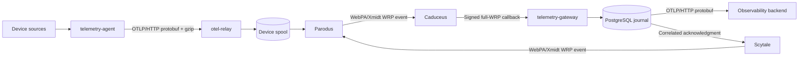

# Proposal: OpenTelemetry Metrics over WebPA

## Executive summary

This proposal establishes WebPA as the managed device-to-cloud transport for OpenTelemetry metrics from RDK devices.

The solution keeps OpenTelemetry standards at the metric-producing and observability boundaries:

- `telemetry-agent` produces standard OTLP metrics on the device.
- `otel-relay` accepts OTLP/HTTP protobuf on loopback, commits the request to durable storage, and carries the immutable request through WebPA/Xmidt.
- `telemetry-gateway` receives authenticated WebPA callbacks, durably deduplicates them, and forwards the original OTLP request to the configured observability backend.
- A correlated acknowledgment returns through WebPA only after the cloud gateway has accepted durable ownership.

WebPA is not presented as an OTLP transport. It is the secure, addressable, fleet-proven middle hop for a private envelope containing an unchanged OTLP request. This preserves OpenTelemetry interoperability while adding the identity, routing retry, and offline behavior required by an RDK fleet.

The core implementation, protocol fixtures, durable stores, service definitions, validation, performance baselines, and operational runbooks are complete. 

### Architecture

The end-to-end path has three deliberately separate protocol boundaries:

| Hop | Protocol | Durable success boundary |
|---|---|---|
| Agent to relay | OTLP/HTTP binary protobuf on `127.0.0.1:4318/v1/metrics` | Exact request and metadata committed to the device spool |
| Relay to gateway | Private protobuf envelope over WebPA/Xmidt | Envelope committed transactionally to PostgreSQL |
| Gateway to backend | OTLP/HTTP binary protobuf | Upstream backend returns an OTLP HTTP success status |

This design keeps WebPA transport concerns out of metric production and keeps metric semantics out of WebPA transport components.

### Device metric production

`telemetry-agent` reads Linux and RDK telemetry from `/proc`, `/sys`, logs, commands, tracefs, and vendor interfaces. A versioned catalog maps reviewed fields to OpenTelemetry metrics and owns:

- metric names, descriptions, and UCUM units;
- gauge, cumulative sum, and cumulative histogram point types;
- monotonicity, temporality, and source timestamps;
- approved Resource and data-point attributes;
- source-value transformations; and
- metric and attribute cardinality limits.

The current baseline pins OpenTelemetry semantic conventions `1.42.0` and schema URL
`https://opentelemetry.io/schemas/1.42.0`. Resource identity includes trusted `host.id`, stable host
and OS attributes, and `service.name=telemetry-agent`.

The initial portable metric set covers memory, CPU, disk, and network observations. The catalog also contains reviewed RDK metrics for supported media, GPU, thermal, wireless, player, and device surfaces. Runtime configuration can enable collection and tune intervals, but cannot redefine metric identity.

The agent exports every 60 seconds by default using OTLP/HTTP protobuf, cumulative temporality, gzip compression, a bounded observation queue, and bounded local retry. It authenticates to the local relay with a root-only bearer credential.

### Device-local durable relay

`otel-relay` is an independent Rust service responsible for transport rather than metric meaning.
It:

1. binds OTLP ingress only to loopback;
2. authenticates the local bearer token;
3. enforces compressed and uncompressed request limits;
4. validates that the request is OTLP metrics protobuf;
5. preserves the original body, content type, and content encoding;
6. assigns a 128-bit UUIDv7 message ID and SHA-256 body digest;
7. commits the request to a checksummed segmented spool; and
8. returns OTLP success only after the request is recoverable.

The production spool is rooted at `/var/lib/otel-relay`, bounded to 64 MiB and 16,384 records, and retains eligible records for up to seven days. Capacity exhaustion returns backpressure instead of evicting accepted telemetry. Startup acquires exclusive state ownership and recovers committed work before opening ingress.

### WebPA transport

The relay registers with Parodus as service `otel-relay` on client port `9902`. Its routing identity is derived from the authenticated device identity:

| Field | Value |
|---|---|
| WRP source | `mac:<normalized-device-id>/otel-relay` |
| WRP destination | `event:rdk-otel-relay/v1` |
| Partner ID | `comcast` |
| Envelope media type | `application/vnd.rdk.otel-relay.v1+protobuf` |
| Acknowledgment source | `dns:telemetry-gateway` |

The private version-1 envelope contains only transport metadata and the immutable OTLP request:

- envelope version;
- 16-byte message ID;
- signal type;
- OTLP content type and content encoding;
- device acceptance timestamp;
- 32-byte SHA-256 body digest; and
- original OTLP request body.

Device identity is intentionally absent from the envelope. The gateway obtains authoritative identity from the authenticated WRP source, preventing a payload from claiming to be another device.

Parodus provides the device-side WebPA connection. Caduceus delivers the complete WRP message to the gateway and signs the serialized callback. Scytale publishes the correlated acknowledgment back to the service-qualified device source.

### Cloud telemetry gateway

`telemetry-gateway` is the cloud-side termination point for the private WebPA envelope. It:

1. verifies the Caduceus HMAC before trusting WRP metadata;
2. extracts the authenticated source, destination, and partner identity;
3. validates envelope version, bounds, message ID, digest, and OTLP structure;
4. authorizes every OTLP `host.id` against the source-to-device policy;
5. assigns the source to an upstream tenant;
6. transactionally inserts the original request and acknowledgment outbox into PostgreSQL;
7. publishes the acknowledgment through Scytale after commit; and
8. exports the unchanged OTLP body to the observability backend.

PostgreSQL is the cloud system of record for accepted envelopes, deduplication, leases, retries, acknowledgment state, and dead letters. Prometheus or another time-series backend does not replace this journal because time-series storage cannot represent private-hop ownership and replay state.

The gateway is schema-blind beyond structural OTLP and identity validation. It does not rename, aggregate, enrich, or re-encode metrics.

## Ownership and delivery semantics

Each acknowledgment transfers responsibility only to the adjacent durable owner:

- Local OTLP success means `otel-relay` owns the request on the device.
- A positive WebPA acknowledgment means `telemetry-gateway` owns the envelope in PostgreSQL.
- Neither response claims that the final observability backend has accepted the request.

The device removes a spool record only after a matching authenticated positive or permanent acknowledgment. Retryable and unknown outcomes retain device ownership and use bounded backoff. The gateway retains cloud ownership across upstream retries and worker restarts; permanent upstream rejections become dead letters rather than requests for device retransmission.

Delivery is at least once across ambiguous network boundaries. Gateway admission deduplicates by the full authenticated WRP source plus message ID and verifies the body digest. A repeated key with the same digest reuses the existing result; a repeated key with a different digest is a permanent integrity error.

The design does not claim exactly-once delivery to the final backend. An upstream backend may accept a request while its response is lost. Stable cumulative streams and point timestamps reduce the impact of that ambiguity but do not change the guarantee.

## Security model

The solution uses independent trust boundaries rather than one credential propagated end to end:

| Boundary | Control |
|---|---|
| Agent to relay | Loopback-only listener and root-only bearer token |
| Device identity | Talaria source enforcement against authenticated WebSocket identity |
| Caduceus callback | HMAC over the complete serialized WRP message |
| Gateway authorization | Authenticated source mapped to allowed `host.id` values and tenant |
| Gateway to backend | Independent upstream authorization header and tenant routing |
| Diagnostics | Bounded counters without credentials, payload bodies, or attribute values |

Changing an unsigned identity header cannot override the signed WRP source. Payload `host.id` is
validated against authenticated transport identity but is never used to authenticate the sender.
Credentials, provisioning data, and metric values are excluded from logs.

## Reliability and capacity

The selected defaults bound device memory, flash use, network retry, and cloud work:

| Control | Baseline |
|---|---:|
| Agent export interval | 60 seconds |
| Agent observation queue | 8,192 submissions |
| Agent local retry budget | 5 minutes |
| Device spool | 64 MiB, 16,384 records |
| Device maximum record age | 7 days |
| Relay in-flight limit | 4 |
| Relay acknowledgment timeout | 30 seconds |
| Gateway deduplication retention | 8 days |
| Gateway export workers | 4 |
| Gateway upstream retry budget | 24 hours |

Seven days at a one-minute interval produces 10,080 requests. The 64 MiB spool supports that full period only while average encoded records, including spool overhead, remain below approximately 6.5 KiB; byte or record capacity may apply before age retention.

Reference tests in the Ubuntu 24.04 development environment measured:

- 834,019 cataloged metrics per second for `/proc/meminfo` collection and mapping;
- 49,754 OTLP assembly and gzip requests per second;
- 9,233 durable device commits per second with commit groups of 32;
- 39-45 ms recovery for 1,024 committed device records;
- 2,592 fresh PostgreSQL admissions per second;
- 8,456 replay admissions per second across 16 concurrent devices; and
- 2,255 successful upstream exports per second with four workers.

These results establish an engineering baseline. Production approval still requires target-device endurance testing, real WebPA latency measurements, and a production-sized networked PostgreSQL load test.

