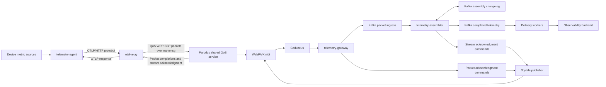

# Proposal: OpenTelemetry Metrics over WebPA with Parodus QoS

## Executive summary

This proposal defines one device-to-cloud path for OpenTelemetry metrics from RDK devices. `telemetry-agent` sends standard OTLP/HTTP protobuf requests to a single loopback `otel-relay` endpoint. `otel-relay` preserves the OTLP bytes in a private RelayEnvelope, divides that envelope into WRP Simple Streaming Protocol (WRP-SSP) packets, and submits every packet through the Parodus nanomsg QoS ingress.

Production telemetry uses acknowledgment-tracked Parodus QoS in the range 25 through 99. Parodus owns bounded admission, priority ordering, reconnect retry, expiry, cloud-acknowledgment correlation, and terminal arbitration. `otel-relay` does not maintain a disk spool, a second delivery lane, or its own send retry queue.

In the cloud, authenticated Caduceus callbacks enter `telemetry-gateway`. The gateway validates and admits packets to Kafka `telemetry-assembler` tolerates duplicate and out-of-order packets, reconstructs the RelayEnvelope, validates the OTLP request, and publishes the completed request and stream-level acknowledgment atomically. Delivery workers export the unchanged OTLP body to the observability backend from Kafka-managed cloud state.

WebPA is the managed WRP transport, not an OTLP transport. OTLP/HTTP remains the interface at the agent, relay, and observability boundaries.

## Goals and non-goals

### Goals

- Provide one telemetry path from the agent through Parodus.
- Preserve exact OTLP request bytes across the WRP hop.
- Use WRP-SSP as the single framing contract for one-packet and multi-packet
  RelayEnvelopes.
- Use the implemented Parodus nanomsg QoS admission and completion contracts.
- Bound device memory by request count, request bytes, and the process-wide Parodus queue limit.
- Correlate every accepted request with one transaction UUID and one terminal completion.
- Authenticate device identity and partner authorization at the cloud edge.
- Scale cloud ingress and delivery through Kafka consumer groups.
- Support staged rollout and rollback without changing the OTLP producer API.

### Non-goals

- Persisting telemetry requests in `otel-relay` across process or device restart.
- Giving Parodus responsibility for decoding OTLP or RelayEnvelope payloads.
- Giving Parodus responsibility for WRP-SSP segmentation or reassembly.
- Allowing local callers to choose arbitrary QoS values per request.
- Claiming exactly-once export to the observability backend.
- Treating a Parodus acknowledgment as proof of final backend acceptance.

## Architecture

There is one device-local submission path. `otel-relay` registers with Parodus as service `otel-relay`, sends complete binary WRP events over nanomsg, and receives synthesized completion events on its registered downstream socket. Every RelayEnvelope uses WRP-SSP, including envelopes that fit in one packet. RBUS clients may use the same Parodus process, but they share the same queue capacity and priority order rather than creating a separate telemetry queue.

## Success boundaries

| Boundary | Success condition |
|---|---|
| Agent to relay | The relay validates the OTLP request and reserves a bounded in-memory correlation slot. |
| Relay to Parodus | Each complete encoded WRP-SSP packet enters the process-wide QoS service. |
| Packet admission | The gateway validates a packet and Kafka accepts it under the configured replication policy. |
| Packet completion | Parodus receives the packet's matching cloud acknowledgment before expiry or shutdown. |
| Stream admission | The assembler reconstructs and validates the complete RelayEnvelope and atomically publishes the completed request and stream acknowledgment. |
| Relay to agent | The relay receives successful completions for every packet and a successful stream acknowledgment, then returns an OTLP success response. |
| Backend export | The backend accepts the OTLP request; an ambiguous response can still cause another export attempt. |

Local OTLP success confirms cloud admission. It does not confirm final observability-backend acceptance.

## Device metric production

`telemetry-agent` reads reviewed Linux and RDK telemetry from `/proc`, `/sys`, logs, commands, tracefs, and vendor interfaces. A versioned metric catalog owns:

- metric names, descriptions, and UCUM units;
- gauge, cumulative sum, and cumulative histogram point types;
- monotonicity, temporality, and source timestamps;
- approved Resource and data-point attributes;
- source-value transformations; and
- metric and attribute cardinality limits.

The baseline pins OpenTelemetry semantic conventions `1.42.0` and schema URL `https://opentelemetry.io/schemas/1.42.0`. Resource identity includes trusted `host.id`, stable host and OS attributes, and `service.name=telemetry-agent`.

The agent exports metrics every 60 seconds using OTLP/HTTP protobuf, cumulative temporality, gzip compression, bounded batches, and its standard bounded HTTP retry behavior. It authenticates to the loopback relay with a root-only bearer credential. Batch limits keep each reconstructed RelayEnvelope within the configured stream byte and packet-count ceilings.

## Single relay path

`otel-relay` exposes one loopback OTLP/HTTP metrics endpoint. For each request it:

1. Authenticates the bearer credential and enforces compressed and uncompressed body limits.
2. Validates the OTLP metrics protobuf without changing the original body bytes.
3. Reserves one bounded in-memory request slot.
4. Generates one UUIDv7 identifier used as the RelayEnvelope message ID and WRP stream ID.
5. Computes the SHA-256 body digest and encodes the private RelayEnvelope.
6. Segments the envelope into bounded WRP-SSP packets, using a one-packet stream when the envelope fits one packet.
7. Assigns each packet a unique WRP transaction UUID and the deployment QoS.
8. Submits packets through the Parodus nanomsg ingress under a bounded in-flight window.
9. Waits for every packet's Parodus completion and the stream-level cloud acknowledgment, or for a terminal packet failure or local request deadline.
10. Maps the terminal stream result to one OTLP/HTTP response and releases the correlation slot.

The relay does not retain the OTLP body after terminal completion. If the relay process exits while requests are active, their HTTP connections fail and the agent may submit replacement requests according to its exporter retry policy.

### Local admission bounds

The relay enforces all of these limits before or during submission:

- maximum compressed OTLP body bytes;
- maximum decoded OTLP body bytes;
- maximum encoded RelayEnvelope bytes;
- maximum decoded packet payload bytes;
- maximum encoded WRP packet bytes;
- maximum packets per stream;
- maximum concurrent HTTP requests; and
- maximum aggregate bytes held by active request correlations.

An input that exceeds the reconstructed stream or packet-count ceiling is rejected with HTTP `413`. Each packet is sized from the encoded WRP frame budget, including MessagePack, stream headers, partner identifiers, and other WRP metadata. The relay retains enough bounded stream state to correlate packet completions and the stream acknowledgment.

## Parodus QoS policy

Phase one uses one deployment-configured QoS value for all telemetry requests. The value must be between 25 and 99 so every accepted event remains correlated until a matching cloud acknowledgment or terminal failure. A proposed baseline is QoS `50`, subject to target-fleet load testing and priority review.

Parodus applies its existing acknowledgment-tracked bands:

| QoS | Band | Telemetry behavior |
|---|---|---|
| 25-49 | Medium | Retry under the configured expiry policy and await cloud acknowledgment. |
| 50-74 | High | Use the same completion contract with precedence over lower pending bands. |
| 75-99 | Critical | Use the highest admission precedence for explicitly approved telemetry. |

The Parodus process must start with a positive `--max-queue-size` value. That limit applies to aggregate live RBUS and nanomsg QoS work. At capacity, a new event can replace only the oldest pending event in a strictly lower band. Claimed and acknowledgment-pending events are not evicted.

The relay does not assume that its configured concurrency is reserved in Parodus. Shared queue pressure can therefore produce `replaced` or `queue_rejected` completions, which become retryable OTLP failures.

Parodus QoS applies independently to each WRP-SSP packet. A packet completion confirms only that packet's terminal transport result. It does not prove that all packets reached the assembler. The relay limits concurrent packet submissions so one stream cannot monopolize the shared Parodus queue. If any packet fails terminally, the relay fails the local request and does not resend the stream itself; the agent can retry the complete OTLP request.

## WRP and RelayEnvelope contract

`otel-relay` uses the existing service-qualified identity and relay route:

| Field | Value |
|---|---|
| Registration | `otel-relay` |
| WRP source | `mac:<normalized-device-id>/otel-relay` |
| WRP destination | `event:rdk-otel-relay/v1` |
| WRP message type | Simple Event (`msg_type=4`) |
| WRP content type | `application/vnd.rdk.otel-relay.v1+protobuf` |
| WRP QoS | Deployment-configured value from 25 through 99 |
| WRP transaction UUID | Unique UUIDv7 generated for each stream packet |
| Partner ID | Configured authorized partner |
| WRP payload | One segment of the encoded version-1 RelayEnvelope |

The RelayEnvelope contains:

- envelope version;
- 16-byte message ID represented by the WRP-SSP stream ID;
- signal type;
- original OTLP content type and content encoding;
- relay acceptance timestamp;
- SHA-256 digest of the original OTLP body; and
- the exact original OTLP request bytes.

Device identity is not copied into the envelope. Cloud authorization uses the authenticated WRP source supplied by the transport boundary.

Parodus preserves source, destination, payload bytes and length, content type, QoS, transaction UUID, partner identifiers, headers, and metadata. It encodes the final cloud-bound event once so reconnect attempts use byte-identical WRP data.

## WRP Simple Streaming Protocol contract

The pipeline follows the [WRP Simple Streaming Protocol](https://github.com/xmidt-org/wrpssp/blob/main/protocol.md). Every RelayEnvelope is represented as one WRP-SSP stream. Even an envelope that fits in one packet carries the stream headers, packet number `0`, and final marker `eof`. There is no second unsegmented WRP form.

Each packet is a WRP Simple Event (`msg_type=4`) with these control headers:

| Header | Contract |
|---|---|
| `stream-id` | Required identifier matching `[A-Za-z0-9_-]+`; unique for the active stream lifetime. |
| `stream-packet-number` | Required zero-based decimal packet number without leading zeroes except `0`. |
| `stream-final-packet` | Present only on the final packet. Value `eof` marks normal completion; another value marks unexpected termination. |
| `stream-encoding` | Optional per-packet value `identity`, `gzip`, or `deflate`; omission means `identity`. |
| `stream-estimated-total-length` | Optional positive decimal estimate; informative only and never allocation authority. |

The stream ID is the URL-safe, unpadded representation of the RelayEnvelope message UUID. All packets in a stream preserve the same authenticated source, destination, content type, partner identifiers, QoS, and application header `telemetry-pipeline-version`. The initial pipeline version is `1`. Each packet has its own transaction UUID so Parodus can correlate packet-level acknowledgment.

Packet payloads are consecutive segments of the encoded RelayEnvelope. The baseline uses `identity` packet encoding because the envelope can already contain a compressed OTLP body. If packet compression is enabled later, each packet is compressed and decoded independently as required by WRP-SSP.

The cloud consumer tolerates out-of-order delivery and exact duplicate packets. It orders payloads by packet number and completes a stream only after receiving an `eof` packet numbered `N` and every packet from `0` through `N`. An exact duplicate is ignored. A duplicate packet number with different payload or immutable metadata terminates the stream as a conflict.

Packet loss recovery is outside WRP-SSP. An incomplete stream remains bounded by packet count, encoded bytes, decoded bytes, packet gap, and idle lifetime, then expires. A late packet cannot resurrect a completed, conflicted, or expired stream while its terminal marker is retained.

## Completion contract

Parodus sends exactly one synthesized completion EVENT to the registered `otel-relay` service for each packet terminal outcome it can route. The completion has source `parodus`, the packet QoS and transaction UUID, content type `application/json`, and a JSON `outcome`.

`otel-relay` accepts a completion only when its transaction UUID matches a live packet correlation. Unknown and duplicate completions are counted and ignored.

| Packet outcome | Relay action |
|---|---|
| `acknowledged` with successful `delivery_result` | Mark that packet admitted; continue until all packets and the stream acknowledgment complete. |
| `invalid_work` | Fail the stream with HTTP `400` when client input is responsible; otherwise use `500`. |
| `queue_rejected` or `replaced` | Fail the stream with HTTP `503` and bounded `Retry-After`. |
| `send_failed`, `expired`, or `shutdown` | Fail the stream with HTTP `503` and bounded `Retry-After`. |
| `internal_error` or `disabled` | Fail the stream with HTTP `500` and raise an operational diagnostic. |
| Local request deadline | Return a retryable HTTP failure and retain only bounded late-completion metadata. |

Outcomes intended for non-acknowledged QoS bands are configuration or protocol errors because production telemetry requires QoS 25 through 99. Completion delivery from Parodus is attempted once. The relay therefore registers its downstream route before opening OTLP ingress and keeps that route alive until ingress and active requests have stopped.

Packet completions do not complete the OTLP request. After reconstructing and admitting the RelayEnvelope, the assembler emits a separate RelayAcknowledgment WRP EVENT addressed to the registered `otel-relay` service. Its payload carries the stream ID, RelayEnvelope message ID, result class, and bounded reason code. It is an ordinary application EVENT rather than a packet delivery report, so Parodus forwards it to the relay after QoS acknowledgment matching does not consume it.

The relay returns OTLP HTTP `200` only after every packet has a successful Parodus completion and the matching RelayAcknowledgment reports successful stream admission. A stream conflict, validation failure, expiry, or negative RelayAcknowledgment maps to one bounded non-success OTLP response.

## Cloud admission and delivery

### Telemetry gateway

Each `telemetry-gateway` replica:

1. Verifies the Caduceus HMAC before trusting WRP metadata.
2. Authorizes the authenticated source and partner for `event:rdk-otel-relay/v1`.
3. Requires Simple Event type, the relay media type, QoS 25 through 99, and a non-empty packet transaction UUID.
4. Parses and validates WRP-SSP control headers and encoded packet bounds.
5. Builds a canonical Kafka key from authenticated source, destination, and stream ID.
6. Publishes a trusted packet record containing authenticated routing metadata, immutable stream metadata packet headers, payload bytes, and transaction UUID.
7. Publishes the packet acknowledgment command only after Kafka accepts the packet record.

Gateway replicas hold no request state after the Kafka operation completes. Kubernetes session affinity is not a correctness requirement.

### Kafka ownership

The initial topic set is:

| Topic | Role |
|---|---|
| `wrp-ssp-packets-v1` | Accepted packet records keyed by authenticated source, destination, and stream ID. |
| Assembler changelogs | Compacted recovery state for active streams and terminal markers. |
| `telemetry-ingress-v1` | Completed, validated RelayEnvelopes keyed by authenticated source and message ID. |
| `telemetry-delivery-retry-v1` | Scheduled backend retries with bounded backoff. |
| `telemetry-delivery-dlq-v1` | Permanently rejected messages and requests beyond retry policy. |
| `telemetry-packet-ack-v1` | Packet acknowledgment commands awaiting Scytale publication. |
| `telemetry-stream-ack-v1` | Stream-level RelayAcknowledgments awaiting Scytale publication. |

Ingress producers use idempotence, `acks=all`, and a replication policy aligned with the service availability objective. Each packet record and its packet acknowledgment command are published in one Kafka transaction so Parodus cannot receive a positive packet result without a corresponding accepted packet.

Retention for ingress, retry, dead-letter, and acknowledgment topics must cover the declared cloud outage and rollback windows. Topic ACLs restrict gateway, delivery, and Scytale publisher access to their required operations.

### Telemetry assembler

`telemetry-assembler` runs as a stateful Kafka consumer group separate from the stateless gateway. Kafka assigns all records for one canonical stream key to one partition while the partition count and partitioner remain stable. Changelog-backed state restores incomplete streams after a crash or rebalance.

For each packet, the assembler:

1. Loads stream state by authenticated source, destination, and stream ID.
2. Validates immutable metadata, packet number, final marker, packet encoding, packet gap, packet count, and byte limits.
3. Ignores an exact duplicate and terminates a conflicting duplicate.
4. Stores out-of-order packet bytes and records the final packet number when an `eof` marker arrives.
5. Completes only when every packet from `0` through the final packet exists.
6. Decodes each packet independently and concatenates payloads in packet-number order under decoded and reconstructed-size limits.
7. Decodes the RelayEnvelope and verifies its version, message ID, body digest, signal type, content type, and content encoding.
8. Validates the OTLP metrics request and approved identity fields without re-encoding the original bytes.
9. Atomically publishes the completed record and RelayAcknowledgment, updates assembly state, records a terminal marker, and commits consumed offsets.

Active streams are bounded per authenticated source and partition by count, packet count, packet gap, encoded bytes, decoded bytes, reconstructed bytes, decompression ratio, and idle lifetime. A scheduled task expires incomplete streams and publishes a negative RelayAcknowledgment. Terminal markers prevent late packets from recreating completed, conflicted, or expired streams.

Changing the packet topic's partition count can remap a stream key. Partition growth therefore uses a new versioned packet topic and assembler generation; one stream is never split across generations.

### Delivery workers

Delivery workers consume accepted RelayEnvelopes, verify trusted routing metadata, and export the unchanged OTLP body. Retryable backend failures move to the retry topic with bounded exponential backoff and jitter. Permanent failures and requests beyond policy move to the dead-letter topic with bounded reason metadata and no payload logging.

Delivery to the backend is at least once. If the backend accepts a request but its response is lost, another attempt can repeat the export. The message ID and body digest support investigation and downstream deduplication where available.

### Acknowledgment publisher

The Scytale publisher consumes both acknowledgment topics. A packet acknowledgment is an acknowledgment-shaped WRP EVENT carrying the packet transaction UUID, QoS, and integer delivery result. Parodus consumes a matching packet event before ordinary client forwarding and sends the normalized `acknowledged` completion to `otel-relay`.

A stream acknowledgment is an application WRP EVENT carrying the stream and RelayEnvelope result. It is addressed to the relay's service-qualified source and forwarded through Parodus without being mistaken for a packet completion.

Publisher retries are independent of gateway HTTP replicas. Duplicate matching acknowledgments are safe: Parodus emits at most one terminal completion for live correlated work and suppresses duplicate raw delivery.

## Startup and shutdown

Device startup order is:

1. Start Parodus with a positive aggregate queue limit and establish Xmidt connectivity.
2. Start `otel-relay`, register service `otel-relay`, and verify its downstream completion route.
3. Open the loopback OTLP listener.
4. Start `telemetry-agent` export.

Shutdown reverses ownership:

1. Stop new agent exports.
2. Close relay OTLP ingress.
3. Wait up to the configured shutdown deadline for active packet completions and stream acknowledgments.
4. Fail remaining HTTP requests and stop the relay registration.
5. Stop Parodus after all local clients have detached.

The relay has no restart recovery phase. Requests interrupted by process or device shutdown are retried by the agent after service recovery.

## Security model

| Boundary | Control |
|---|---|
| Agent to relay | Loopback-only listener and root-only bearer token. |
| Relay configuration | Root-owned file; callers cannot override source, destination, partner, or QoS. |
| Device identity | Talaria source enforcement against authenticated WebSocket identity. |
| Caduceus callback | HMAC over the complete serialized WRP message. |
| Gateway authorization | Authenticated source and partner mapped to approved destination and tenant. |
| Gateway to Kafka | Mutual authentication, encryption in transit, quotas, and scoped topic ACLs. |
| Telemetry assembler | Consumer-group, changelog, completed-topic, and stream-acknowledgment ACLs scoped to its application identity. |
| Delivery to backend | Independent authorization and tenant routing from trusted cloud policy. |
| Diagnostics | Bounded counters without credentials, payloads, metric attributes, or provisioning data. |

Binary payloads are never formatted as strings in logs. Device logs may include bounded transaction identifiers, QoS, outcome, encoded size, queue occupancy, and latency. Cloud logs use authenticated identity and message ID but omit OTLP bodies and attribute values.

## Reliability and capacity

The device path is memory-backed. Parodus reconnect retry protects against temporary cloud disconnection while the process remains alive, but accepted work does not survive a Parodus restart. Relay correlations do not survive a relay restart. The agent's exporter retry is the recovery mechanism for failed or interrupted local HTTP requests.

Required device controls and signals include:

- relay active request count and bytes;
- relay active streams, packets per stream, in-flight packet window, and terminal packet failures;
- relay request age and deadline expirations;
- Parodus aggregate queue occupancy and configured maximum;
- Parodus enqueue, replacement, rejection, send, retry, expiry, acknowledgment, and shutdown outcomes by QoS band;
- Xmidt connectivity and acknowledgment latency; and
- agent export attempts, retry count, batch bytes, and response classes.

Required cloud signals include:

- Caduceus callback rate, authentication failures, and validation failures;
- Kafka packet produce latency, transaction failures, replication health, disk headroom, and consumer lag;
- assembler active streams, buffered bytes, gaps, duplicates, conflicts, expiry, restoration time, and completion latency;
- acknowledgment command age and Scytale publish outcomes;
- backend export latency, retry age, and dead-letter count; and
- end-to-end latency from relay acceptance to cloud acknowledgment and backend acceptance.

Production sizing requires expected device count, export cadence, compressed and uncompressed request sizes, packet amplification, encoded packet size, maximum stream lifetime, Parodus expiry, queue occupancy from other clients, Xmidt outage duration, Kafka replication, assembler restoration time, backend throughput, and a safety margin. Target-device tests and production-shaped cloud load tests are required before promotion.

## Required implementation changes

### telemetry-agent

- Use one OTLP/HTTP metrics endpoint at `127.0.0.1:4318`.
- Bound batches to the relay's reconstructed stream and packet-count ceilings.
- Treat non-success relay responses and connection loss as retryable according to the standard exporter policy.
- Export counters for attempts, retries, response classes, and dropped observations without metric payload data.

### otel-relay

- Retain one authenticated OTLP listener and one bounded in-memory correlation table.
- Remove disk-spool admission, recovery, inspection, and migration behavior.
- Remove alternate destination, listener, queue, scheduler, and worker configuration.
- Generate one RelayEnvelope and stream ID per request.
- Segment every RelayEnvelope with a conforming WRP-SSP implementation, including one-packet streams.
- Generate a unique transaction UUID for every packet and submit complete Simple Events through the Parodus nanomsg client with the configured QoS.
- Enforce stream byte, packet-count, and in-flight packet-window bounds.
- Decode and correlate Parodus packet completion events and stream-level RelayAcknowledgments.
- Map exactly one terminal stream result to each active OTLP response.
- Validate configuration and readiness before opening ingress.

### Parodus

- Deploy a build containing the shared process QoS service and nanomsg EVENT integration.
- Configure a positive `--max-queue-size` appropriate for aggregate RBUS and nanomsg traffic.
- Preserve WRP-SSP headers, complete WRP fields, and byte-identical packet retry payloads while remaining unaware of stream assembly semantics.
- Route acknowledgment-shaped cloud events through QoS correlation before ordinary registered-client forwarding.
- Keep the `otel-relay` registration alive until active work is completed or shut down.

### Cloud services

- Accept only the relay destination and media type for this path.
- Validate authenticated identity, WRP-SSP headers, and packet bounds before packet admission.
- Add a stateful assembler with changelog-backed recovery, duplicate and out-of-order handling, bounded expiry, and terminal markers.
- Validate reconstructed RelayEnvelope integrity, OTLP syntax, and all configured bounds before stream admission.
- Publish packet records with packet acknowledgment commands atomically, and completed telemetry with stream acknowledgments atomically.
- Export accepted OTLP through bounded Kafka consumer concurrency and retry policy.
- Preserve transaction identifiers and bounded outcome diagnostics end to end.

## Recommended cloud upgrade path

Cloud upgrades use a producer-last sequence: consumers learn the next contract before any producer emits it. The current and immediately previous record versions remain readable throughout the observation and rollback windows. Authentication rules, canonical stream keys, partitioners, topic partition counts, assembler application IDs, store names, and transaction boundaries remain unchanged during an ordinary rolling upgrade.

### Compatible rolling upgrade

Use this path for additive fields, validation changes that accept both versions, performance fixes, and implementation changes that do not alter keys, partition mapping, state schemas, or topic topology:

1. Record the current contract version `N`, deployed image digests, topic configuration, assembler state-store health, consumer offsets, and rollback images. Block the rollout if Kafka replication, transaction coordinators, changelog restoration, acknowledgment age, or consumer lag is already unhealthy.
2. Upgrade delivery workers and Scytale publishers first. They must consume both `N` and `N+1` records while continuing to produce only `N` where they produce records.
3. Upgrade `telemetry-assembler` instances one at a time using cooperative rebalancing, a PodDisruptionBudget, stable application and store names, and graceful transaction shutdown. Each instance reads `N` and `N+1` packet records but emits `N` completed and acknowledgment records. Readiness remains false until assigned state stores restore and processing catches up.
4. After every assembler instance is healthy, enable `N+1` completed and stream-acknowledgment emission. Confirm downstream consumers accept it before continuing.
5. Roll stateless `telemetry-gateway` replicas. During the mixed-image window, every replica accepts both supported pipeline contract versions of the same WRP-SSP form and emits packet records and packet acknowledgments in version `N`.
6. After all gateway replicas run the new image, switch packet-record and packet-acknowledgment emission to `N+1` with one reversible configuration change.
7. Hold at each canary stage while packet admission errors, assembler conflicts and expiry, restoration time, transaction aborts, acknowledgment age, completed-topic lag, backend failures, and end-to-end latency remain within the declared thresholds.
8. Retire `N` readers only after the maximum packet retention, stream lifetime, terminal-marker retention, completed-record retention, acknowledgment retry, and rollback windows have all elapsed.

Gateway replicas are stateless and may use a normal rolling update. Stateful assembler replicas never restart as a group. Delivery and acknowledgment workers stop fetching new records, finish or abort the current transaction, commit only completed work, and then terminate.

### State or topology breaking upgrade

Use a blue-green generation when changing canonical key encoding, partitioner, packet-topic partition count, packet or completed-record major version, assembler application ID, store name, state schema, transaction topology, or stream identity rules. Do not mutate those properties in place.

1. Provision a complete `vN+1` topic set, changelogs, transaction IDs, quotas, ACLs, dashboards, and alerts without modifying the `vN` resources.
2. Deploy `vN+1` delivery and acknowledgment consumers, then deploy the `vN+1` assembler with a distinct application ID and state stores. Verify the new stack with synthetic one-packet, multi-packet, duplicate, out-of-order, conflicting, and expiring streams.
3. Upgrade gateways so every replica can route both generations. The gateway selects the topic generation from the immutable `telemetry-pipeline-version` header; it never selects from process-local state or arrival time.
4. Enable `otel-relay` generation `N+1` for a deterministic device cohort. A relay chooses the generation when a stream starts and copies it unchanged to every packet. An active stream never changes generation.
5. Expand the cohort only after all `vN+1` promotion gates pass. Keep the complete `vN` gateway route, assembler, consumers, topics, and changelogs active for streams that started on `N`.
6. Stop assigning new streams to `N` after full promotion, then wait for every `vN` active stream, packet record, completion, retry, and acknowledgment to complete or expire through the rollback window.
7. Disable `vN` processing before deleting anything. Delete old topics and state only through a separate approved cleanup after retained offsets, terminal markers, audit evidence, and rollback requirements no longer need them.

Never dual-publish one stream to both generations and never split its packets between topic generations. Those patterns can create competing assemblies and acknowledgments. If an `N+1` rollback is required, stop assigning new streams to `N+1`, return new streams to `N`, and leave both cloud generations running until existing `N+1` streams terminate.

### Kafka broker upgrade

Broker maintenance is separate from application and contract rollout:

1. Freeze application schema, topology, partition-count, and pipeline-generation changes.
2. Verify controller health, in-sync replicas, disk headroom, transaction coordinators, producer success, consumer lag, and assembler restoration before touching a broker.
3. Roll one broker at a time while preserving the configured minimum in-sync replicas for every pipeline topic.
4. Confirm partition leadership, transactions, packet acknowledgments, assembler progress, changelog writes, and backend delivery after each broker returns.
5. Advance broker protocol or metadata compatibility only after all brokers run the target version and the previous broker version remains a tested rollback target.

### Promotion and rollback gates

Each stage has explicit pass/fail thresholds for callback authentication failures, invalid packet rate, Kafka produce failures, under-replicated partitions, transaction aborts, consumer lag, assembler restore time, active-stream age, conflicts, expiry, packet-acknowledgment age, stream-acknowledgment age, and backend export failures. A stage stops automatically when a threshold is exceeded.

Image rollback is allowed only while record and state contracts remain compatible. Contract or topology rollback uses the parallel generation procedure. Topics, changelogs, and terminal markers are never deleted by an image rollback, and cloud acknowledgment routes remain active until the longest in-flight stream and Parodus expiry window has closed.

## Rollout and validation

Rollout is cloud-first:

1. Provision versioned packet, changelog, completed, retry, dead-letter, and acknowledgment topics with replication, transactions, ACLs, quotas, retention, and monitoring.
2. Deploy delivery workers and the Scytale acknowledgment publisher.
3. Deploy `telemetry-assembler` and verify state restoration, out-of-order assembly, duplicate handling, expiry, and stream acknowledgment.
4. Deploy gateway packet validation and transactional packet/acknowledgment publication.
5. Verify synthetic WRP-SSP streams produce packet completions, exact reconstructed bytes, and one stream acknowledgment.
6. Deploy Parodus with nanomsg QoS enabled and a positive aggregate queue limit to a device canary.
7. Deploy the simplified `otel-relay` with OTLP ingress disabled and verify Parodus registration, packet completion routing, and stream acknowledgment routing.
8. Enable relay ingress, then enable `telemetry-agent` for a deterministic canary cohort.
9. Expand by device model and cohort while queue pressure, stream expiry, assembler restoration, acknowledgment latency, Kafka lag, and backend outcomes remain within objectives.

Required tests include:

- exact OTLP byte preservation through RelayEnvelope and WRP encoding;
- binary payloads containing embedded zero bytes;
- one-packet and multi-packet streams;
- valid and invalid stream IDs, packet numbers, final markers, and encodings;
- out-of-order packets, exact duplicates, conflicting duplicates, missing packets, unexpected final markers, and late packets after terminal state;
- per-packet transaction UUID uniqueness and missing UUID handling;
- queue admission, cross-transport replacement, and queue rejection;
- cloud disconnection, reconnect retry, expiry, and shutdown;
- acknowledgment before send-state transition, duplicate acknowledgment, and acknowledgment/expiry races;
- relay completion delivery, unknown completion, late completion, and client disconnect;
- assembler crash and restore, consumer rebalance, transaction abort, stream expiry, and versioned topic migration;
- relay and Parodus restart during active requests;
- Caduceus authentication failure and unauthorized source or partner;
- Kafka transaction abort, broker leader movement, and acknowledgment publisher outage;
- backend timeout, retry, permanent rejection, and ambiguous success response; and
- full RBUS-enabled and RBUS-disabled Parodus test matrices.

Rollback disables new agent exports first, drains active relay HTTP requests up to the bounded shutdown deadline, and then restores the previous device services. Cloud authorization and acknowledgment publication remain active
through the maximum Parodus expiry and rollback observation window so in-flight canary events can terminate cleanly.

## Open decisions

1. Confirm the initial telemetry QoS value; QoS `50` is the proposed baseline.
2. Set relay request-count, aggregate-byte, and request-deadline limits relative to the process-wide Parodus queue.
3. Set compressed OTLP, decoded OTLP, RelayEnvelope, raw packet, encoded WRP, packet-count, packet-gap, and reconstructed stream ceilings with measured framing overhead.
4. Define the successful cloud `delivery_result` value and bounded permanent failure values shared by gateway, Scytale, Parodus, and relay.
5. Set Parodus retry and expiry intervals for the expected Xmidt outage window.
6. Confirm Kafka replication, transaction timeout, retention, partition count, and consumer concurrency from fleet load estimates.
7. Set the assembler idle lifetime, terminal-marker retention, decompression ratio, and state restoration objective.
8. Define the maximum time a relay retains metadata for completions arriving after the local HTTP request deadline.
9. Confirm that production Xmidt and Caduceus preserve WRP-SSP headers, QoS, transaction UUID, binary payloads, partner identifiers, and acknowledgment fields end to end.